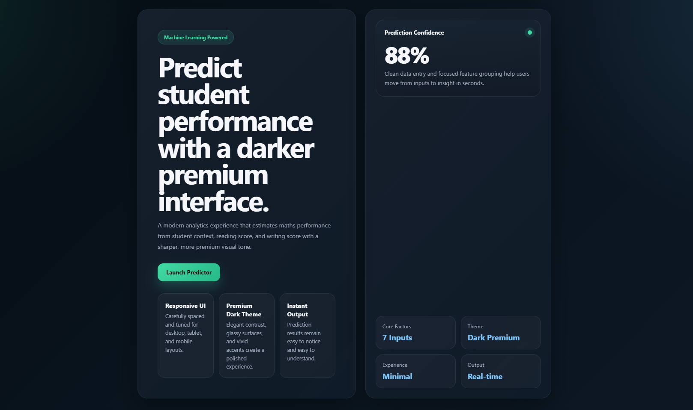

# Student Performance Prediction System

A machine learning-powered web application that predicts a student's **Maths score** based on demographic and academic input features such as gender, ethnicity, parental education, lunch type, test preparation course, reading score, and writing score.

## Overview

This project combines:
- **Machine Learning** for student score prediction
- **Flask** for the web application backend
- **HTML/CSS** for a responsive frontend interface

The system takes user inputs through a web form, processes them using a trained preprocessing pipeline, and returns the predicted maths score.

## Features

- Predicts student maths performance using ML
- Clean and responsive frontend UI
- Flask-based web app
- Modular training and prediction pipeline
- Uses serialized model and preprocessor files for inference

## Input Features

The model uses the following inputs:
- Gender
- Race / Ethnicity
- Parental level of education
- Lunch type
- Test preparation course
- Reading score
- Writing score

## Tech Stack

- Python
- Flask
- Scikit-learn
- Pandas
- NumPy
- HTML
- Seaborn
- Matplotlib

